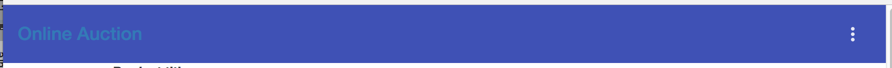
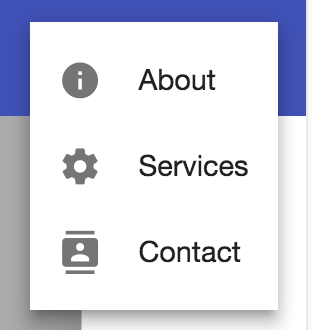
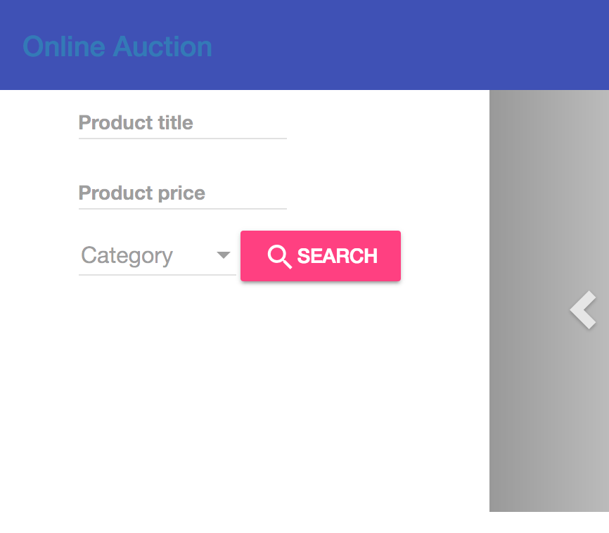
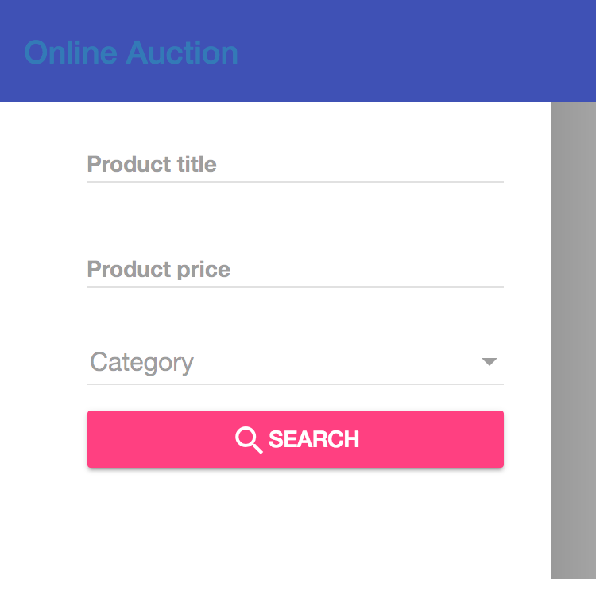
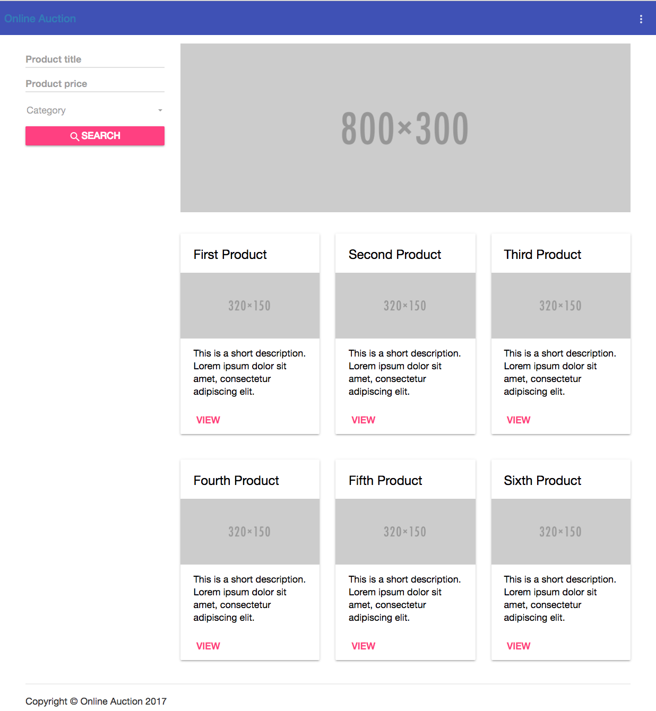

:icons: font
:idprefix:
:idseparator: -
:sectanchors:
:sectlinks:
:sectnums:
:sourcedir: ../code
:source-highlighter: highlightjs

== Hands-on: Introducing Angular Material 2 components in the auction app

This version of the auction consists of two separate projects: one for the client (Angular) and one for the server (Node.js). We'll take the version of the auction app located in the directory client and will gradually replace the template of each component (and their Bootstrap styles) to introduce Angular Material 2 components. The server side of the auction remains unchanged.

=== Starting the server and the client of the auction

In the command window, change to the folder auction3_handson/auction/server and install project dependencies by running the `npm i` or `yarn` command.

Compile the TypeScript code into the build directory:

[source]
----
npm run tsc
----

Start the Node server on port 8000:

[source]
----
npm run startServer
----

NOTE: In the above two commands you can replace npm with yarn. 

Ensure that the server returns JSON with products by entering http://localhost:8000/api/products in your browser. Note that the server runs on port 8000, while the client will run on port 4200.

Open the dir auction3_handson/auction/client in your IDE. Install the dependencies and run the client with the command that uses proxy-config (see the start script in package.json):

[source]
----
npm start
----

Open your browser at localhost:4200 and you'll see the landing page of the auction. Keep the client running so you'll see how the UI will change as you'll be introducing Angular Material 2 components.

=== Redesigning the client

NOTE: The completed version of the auction client is located in the directory auction/client-completed.

==== Adding Angular Material 2 to the project 

Add Angular Material 2 to the project in the client directory:

[source]
----
yarn add @angular/material
yarn add @angular/animations

or 

npm i @angular/material --save
npm i @angular/animations --save
----

Add the indigo-pink to the file styles.css. Replace the existing content of styles.css with the following:

[source]
----
@import '~@angular/material/prebuilt-themes/indigo-pink.css';
----

==== Adding a feature module with material components

We need to create a module that will declare only those material components that will be used in this app. Generate a new `AuctionMaterialModule` by running the following command:

[source]
----
ng g m AuctionMaterial
----

Modify the code of the generated file auction-material.module to look as follows:

[source]
----
import { NgModule } from '@angular/core';
import { CommonModule } from '@angular/common';
import {
  MdToolbarModule, MdIconModule, MdMenuModule,MdButtonModule,
  MdInputModule, MdSelectModule, MdOptionModule,
  MdCardModule
} from '@angular/material';
import {BrowserAnimationsModule} from '@angular/platform-browser/animations';

@NgModule({
  imports: [
    CommonModule
  ],
  exports: [
    MdToolbarModule, MdIconModule, MdMenuModule, MdButtonModule,
    MdInputModule, MdSelectModule, MdOptionModule, MdCardModule,
    BrowserAnimationsModule
  ]
})
export class AuctionMaterialModule { }
----

Note that this is a feature module (see `CommonModule` in imports). To make material modules available in the app.module, we listed them in the `exports` property.

Open the file app.module.ts and add `AuctionMaterialModule` to its `imports`:

[source]
----
import {AuctionMaterialModule} from "./auction-material/auction-material.module";
...
@NgModule({
  ...
  imports: [
    ...
    AuctionMaterialModule
  ]
  ...
})
----

==== Modifying the template of NavbarComponent

Note that the navbar has a menu. We'll replace the content of navbar.component.html so it uses `<md-toolbar>` that will contain a menu of the auction. First, remove the current content of this file and add an empty toolbar there: 

[source]
----
<md-toolbar color="primary"></md-toolbar>
----
The auction app renders an empty toolbar. We want the toolbar to contain the link to the home page and a popup menu that will be activated by the button. The button should contain an icon that looks as three vertical dots. The directive `md-icon-button` turns a regular button into a button that can contain `<md-icon>`.

Add the link and the button by modifying the content of navbar.component.html to look as follows:

[source]
----
<md-toolbar color="primary">

<a [routerLink]="['/']">Online Auction</a>

<button md-icon-button >
  <md-icon>more_vert</md-icon>
</button>

</md-toolbar>
----

The toolbar will look like this:

[[FIG3-1]]

The name of the icon we need is `more_vert`, but we forgot to add Google material icons to index.html. Add the following to the `<head>` section of index.html:

[source]
----
 <link href="https://fonts.googleapis.com/icon?family=Material+Icons" rel="stylesheet">
----

Now the icon `more_vert` is properly shown on the button:

[[FIG3-2]]

The next step is to push this button to the right side of the toolbar regardless of the screen width. We'll add a `
` between the link and the button to fill the space. Add the following style to the navbar.component.css:

[source]
----
.fill {
  flex: 1;
}
----

By default, the toolbar has the CSS flexbox layout. The style `flex:1` means "give the entire width to the HTML element".

NOTE: You can read about flexbox here: https://css-tricks.com/snippets/css/a-guide-to-flexbox.

Now place the `
` between the `<a>` and `<button>` tags in navbar.component.html:

[source]
----

----

Now the button is pushed all the way to the right:

[[FIG3-3]]

But clicking on the button doesn't open any menu because:

1. We haven't created a menu yet. 
2. We haven't linked our toolbar button to the menu

The menu is represented by the component `<md-menu>` that contains one or more items represented by `<button md-menu-item>` components. To make our button fancy, we'll use `<md-icon>` on each button.

Our auction had three links: About, Services, and Contacts. Let's turn them into a popup menu. Each menu item will have an icon.

Add the following code below `</md-toolbar>` in navbar.component.html:

[source]
----
<md-menu #menu="mdMenu">
  <button md-menu-item>
    <md-icon>info</md-icon>
    About
  </button>
  <button md-menu-item>
    <md-icon>settings</md-icon>
    Services
  </button>
  <button md-menu-item>
    <md-icon>contacts</md-icon>
    Contact
  </button>
</md-menu>
----

Note that we declared used a template variable `#menu` to reference this component and initialized it with the value `mdMenu`. By itself, the `<md-Menu>` doesn't render anything. The menu is attached and opened by applying the directive `mdMenuTriggerFor`.  

NOTE: You can replace `<button>` tags with <a [routerLink]..> links.

To link the toolbar button with the menu, bind the variable `menu` to the directive `mdMenuTriggerFor` of the toolbar button. It should look as follows:

[source]
----
<button md-icon-button [mdMenuTriggerFor]="menu">
  <md-icon>more_vert</md-icon>
</button>
----

If you click on the toolbar button now, it'll show the menu:

[[FIG3-4]]

==== Modifying the template of SearchComponent

The template of the SearchComponent contains a form with a text input, a number input, and a select dropdown. We'll replace these HTML elements `<input>` and `<select>` with their material counterparts `<md-input>` (should be placed inside `<md-input-container>`) and `<md-select>`. 

We'll also add a directive `md-raised-button ` and the search icon to the submit button.

Modify the code in the file search.component.html to look like this:

[source]
----
<form [formGroup]="formModel"
      (ngSubmit)="onSearch()"
      novalidate>

  <md-input-container>
    <input mdInput
           type="text"
           placeholder="Product title"
           formControlName="title">
  </md-input-container>

   <md-input-container>
    <input mdInput
           type="number"
           placeholder="Product price"
           formControlName="price">
  </md-input-container>

   <md-select placeholder="Category" formControlName="category">
    <md-option *ngFor="let c of categories"
               [value]="c">{{ c }}</md-option>
   </md-select>

  <button md-raised-button color="accent" type="submit">
    <md-icon>search</md-icon>SEARCH
  </button>
</form>
---- 

The above template doesn't have all the validators from the original form, but we'll add them later. Let's make sure that the UI is properly rendered. For now, it looks like this:

[[FIG3-5]]

The input components and the select dropdown need to occupy the entire width of the component. We also need more space between the form controls. 

Add the following styles to search.component.css:

[source]
----
md-input-container, md-select, [md-raised-button] {
  display: block;
  margin-top: 16px;
  width: 100%;
}
---- 

The `display: block;` tells the browser to render the search component as a standard `
`. Now the UI looks better:

[[FIG3-6]]

Let's add the validation for the form's title and price controls by using the following features of material inputs:

1. The `<md-hint>` component allows to provide the text to prevent validation errors. We'll use the `*ngIf` directive to optionally show the hint text. 
2. The directive `dividerColor` allows painting the border of the input field in a different color, if its value is invalid.

The final version of search.component.html should look like this:

[source]
----
<form [formGroup]="formModel"
      (ngSubmit)="onSearch()"
      novalidate>

  <md-input-container [dividerColor] = "formModel.hasError('minlength','title')?'warn':'default'">
    <input mdInput
           type="text"
           placeholder="Product title"
           formControlName="title"
           minlength="3">
    <md-hint *ngIf="formModel.hasError('minlength','title')" >Enter at least 3 characters</md-hint>

  </md-input-container>

  <md-input-container  [dividerColor] = "formModel.hasError('positivenumber', 'price')?'warn':'default'">
    <input mdInput
           type="number"
           placeholder="Product price"
           formControlName="price">
    <md-hint *ngIf="formModel.hasError('positivenumber', 'price')" >The price must be a positive number</md-hint>
  </md-input-container>

  <md-select placeholder="Category" formControlName="category">
    <md-option *ngFor="let c of categories"
               [value]="c">{{ c }}</md-option>
  </md-select>

  <button md-raised-button color="accent" type="submit">
    <md-icon>search</md-icon>SEARCH
  </button>
</form>
----

==== Replacing the carousel with an image

At the time of this writing, Angular Material 2 doesn't have a carusel component. In the real world project, you'd find the carousel component in a third party library, e.g. in the PrimeNG library http://www.primefaces.org/primeng/#/carousel.

But we'll just replace the carousel with an image.

Replace the content of carousel.component.html with the following code:

[source]
----

----

Now the bowser shows a gray rectangle in place of the carousel. But this image has a fixed width, and if you'll try to lower the width of the browser's window, this rectangle may not fit inside the home component. To fix so the browser will use all available width of the container where the image lives.

[source]
----
img {
  width: 100%;
}
----

==== More fixes with spacing

Let's add some space between the toolbar and other components by adding the following style to the app.component.css:

[source]
----
.container {
  margin-top: 16px;
}
----

Now let's add some space between the carousel and product items. The home.component.css should look like this (`display:block` is for rendering this custom component as `
`).

[source]
----
:host {
  display: block;
}

auction-carousel {
  margin-bottom: 16px;
}
----

To ensure that the images of each product are not wider than their containers, add the following style to the file src/styles.css:

[source]
----
.thumbnail img {
  width: 100%;
}
----

==== Using cards in HomeComponent

We want to display our products as a grid, and each `<auction-product-item>` will use the `<md-card>` component inside. 

Modify home.component.html to look like this:

[source]
----
<auction-carousel></auction-carousel>

{{ errorMessage }}

  <auction-product-item *ngFor="let product of products | async"
                        [product]="product"></auction-product-item>

----

Now add more styles to home.component.html so the products are displayed nicely aligned using the CSS flexlayout. We'll also a couple of CSS media queries to make the layout of this grid responsive. 

Add the following styles to home.component.css:

[source]
----
.product-grid {
  display: flex;
  flex-wrap: wrap;
  margin: 0 -8px;
}

auction-product-item {
  margin: 0 8px 16px;
  flex-basis: calc(100% / 3 - 16px);
}

@media (max-width: 1199px) {
  auction-product-item {
    flex-basis: calc(50% - 16px);
  }
}

@media (max-width: 599px) {
  auction-product-item {
    flex-basis: calc(100% - 16px);
  }
}
----

==== Using md-card in ProductItemComponent

To render each product inside the Angular material card, modify the content of the file product-item.component.html to look like this:

[source]
----
<md-card>
  <md-card-title>{{ product.title }}</md-card-title>
  
  <md-card-content>
    {{ product.description }}
  </md-card-content>
  <md-card-actions>
    <a md-button color="accent" [routerLink]="['/products', product.id]">VIEW</a>
  </md-card-actions>
</md-card>
----

Now the landing page of the auction has more modern look comparing the its initial version. 

[[FIG3-7]]

We didn't change the look of the product detail page. See if you can do it on your own.

NOTE: When all standard HTML elements are replaced with the Angular Material 2 components, remove the dependency on the Bootstrap library from package.json and .angular-cli.json.